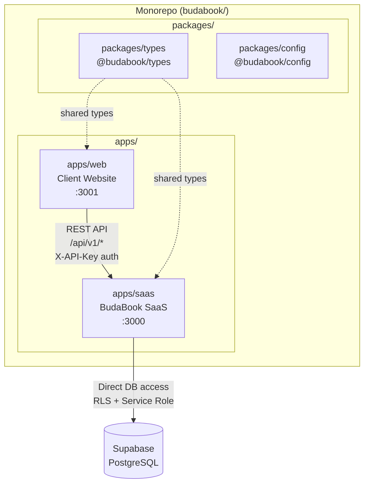
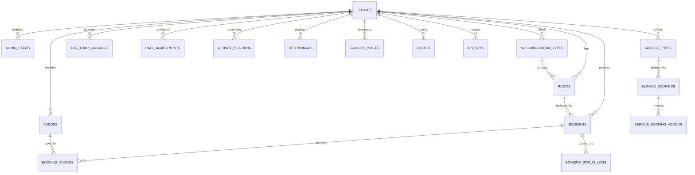
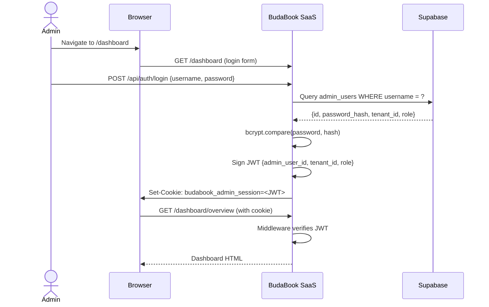
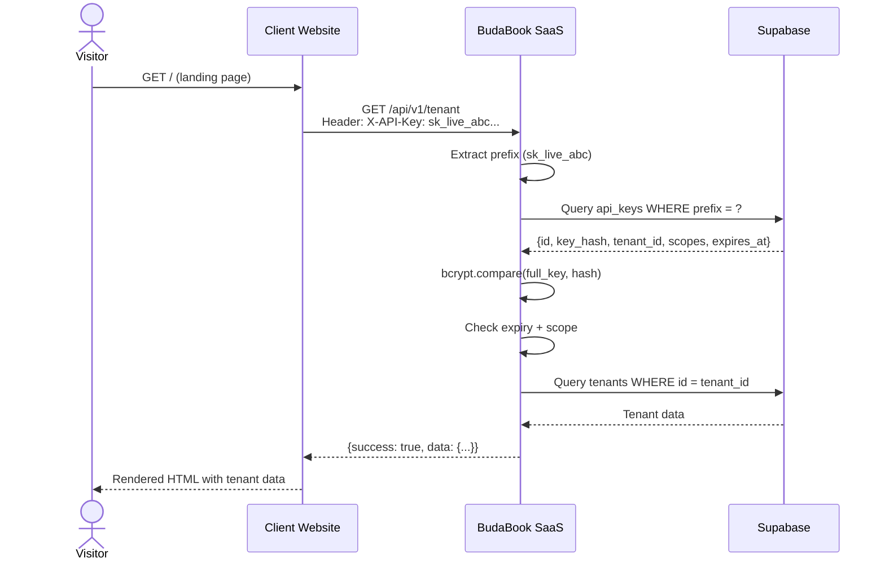
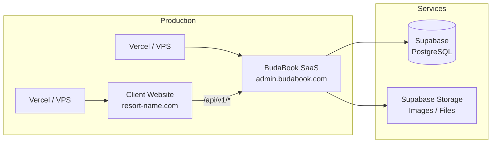

# BudaBook — System Architecture

> **Version**: 1.1 | **Last Updated**: February 2026

## 1. System Overview

BudaBook is a **multi-tenant resort management platform** split into two independent applications:

| Application | Package | Port | Purpose |
|-------------|---------|------|---------|
| **BudaBook SaaS** | `@budabook/saas` | 3000 | Admin dashboard, CRM, booking management, and data APIs |
| **Client Website** | `@budabook/web` | 3001 | Public-facing resort website (fetches data from SaaS via API) |

Both apps live in a **Turborepo monorepo** and share types via the `@budabook/types` package.



---

## 2. Multi-Tenant Data Model

Every table in the database includes a `tenant_id` column. Each tenant represents a **resort or property** — their data is completely isolated.



### Tenant Isolation

- All Supabase queries include `.eq('tenant_id', tenantId)`
- The `tenantId` comes from the authenticated JWT (admin users) or API key (client websites)
- There is **no way** for one tenant to access another tenant's data

### User Roles

| Role | Access |
|------|--------|
| `super_admin` | Full access to all tenant data and settings |
| `resort_admin` | Full access to their assigned tenant only |
| `staff` | Limited access — bookings and guest management only |

---

## 3. Authentication

### 3.1 Admin Authentication (SaaS)

The SaaS app uses **JWT-based session authentication** stored in an httpOnly cookie.



**Security measures:**
- Passwords hashed with **bcrypt** (12 rounds)
- JWT signed with **HS256** using `JWT_SECRET` env var
- Cookie: `httpOnly`, `secure` (production), `sameSite: lax`, 7-day expiry
- `JWT_SECRET` is **required** in production — app throws if missing

### 3.2 API Key Authentication (Client Website → SaaS)

Client websites authenticate using **API keys** sent in the `X-API-Key` header.



**API key structure:**
- Format: `sk_live_<random>` (prefix used for fast lookup)
- Stored as **bcrypt hash** (never in plaintext)
- Scoped by permissions (e.g., `read:tenant`, `read:rooms`, `write:inquiries`)
- Optional expiration date
- `last_used` timestamp tracked

---

## 4. API Architecture

### 4.1 Versioned API (`/api/v1/`)

All client-facing endpoints live under `/api/v1/` and go through the `createV1Handler` factory:

```
Request → CORS → API Key Auth → Scope Check → Rate Limit → Handler → Response
                                                                        ↓
                                                              CORS headers added
```

### 4.2 Endpoints

| Method | Endpoint | Scope | Description |
|--------|----------|-------|-------------|
| GET | `/api/v1/tenant` | `read:tenant` | Tenant details (name, branding, contact) |
| GET | `/api/v1/sections` | `read:sections` | Visible website sections |
| GET | `/api/v1/accommodation-types` | `read:accommodations` | Active room types with pricing |
| GET | `/api/v1/rooms` | `read:rooms` | Rooms, optionally filtered by type |
| GET | `/api/v1/addons` | `read:addons` | Active add-ons (meals, activities) |
| GET | `/api/v1/testimonials` | `read:testimonials` | Featured guest reviews |
| GET | `/api/v1/rate-adjustments` | `read:rates` | Active seasonal pricing |
| GET | `/api/v1/availability` | `read:availability` | Room availability by date range |
| POST | `/api/v1/calculate-price` | `read:pricing` | Price calculation for a booking |
| POST | `/api/v1/inquiries` | `write:inquiries` | Submit a guest inquiry |

### 4.3 Rate Limiting

- In-memory sliding window (per IP + endpoint)
- Default: **60 requests / 60 seconds**
- Returns `429 Too Many Requests` with `Retry-After` header

### 4.4 CORS

- Configured via `CORS_ALLOWED_ORIGINS` environment variable
- Preflight (OPTIONS) requests bypass authentication
- CORS headers added to **all** responses including errors

---

## 5. Data Flow

### 5.1 Client Website → SaaS API

The client website (`apps/web`) **never accesses the database directly**. All data flows through the SaaS API:

```
┌─────────────────┐        REST API        ┌─────────────────┐        SQL         ┌──────────┐
│   Client Web    │ ──────────────────────► │   BudaBook SaaS │ ──────────────────► │ Supabase │
│   (apps/web)    │  X-API-Key header       │   (apps/saas)   │  Service Role Key   │PostgreSQL│
│   Port 3001     │ ◄────────────────────── │   Port 3000     │ ◄────────────────── │          │
│                 │    JSON responses       │                 │   Query results     │          │
└─────────────────┘                         └─────────────────┘                     └──────────┘
```

### 5.2 Typed API Client

The client website uses `lib/api-client.ts` — a typed HTTP client that:
- Sends `X-API-Key` header on every request
- Returns typed responses matching `@budabook/types`
- Uses Next.js ISR (revalidates every 60 seconds)
- Never exposes the API key to the browser (server-side only)

---

## 6. SaaS App Structure

```
apps/saas/
├── app/
│   ├── page.tsx              ← Redirects to /dashboard
│   ├── layout.tsx            ← Root layout (fonts, metadata)
│   ├── globals.css           ← Global styles
│   ├── dashboard/
│   │   ├── page.tsx          ← Admin login page
│   │   ├── layout.tsx        ← Dashboard layout (sidebar + header)
│   │   ├── overview/         ← Main dashboard overview
│   │   ├── bookings/         ← Booking management
│   │   ├── calendar/         ← Calendar view
│   │   ├── day-tours/        ← Day tour management
│   │   ├── guests/           ← Guest CRM
│   │   ├── accommodations/   ← Room type management
│   │   ├── addons/           ← Add-on management
│   │   ├── rates/            ← Rate adjustment management
│   │   ├── reports/          ← Analytics & reports
│   │   ├── audit-log/        ← Activity audit log
│   │   └── settings/         ← Tenant settings & branding
│   └── api/
│       ├── auth/             ← Login/logout endpoints
│       ├── public/           ← Legacy public API (backwards compat)
│       └── v1/               ← Versioned API for client websites
│   ├── book/
│   │   └── [tenant]/         ← Public booking flow (/book/taglucop-strawberry-hills)
├── components/
│   ├── admin/                ← Dashboard components (sidebar, header)
│   ├── booking/              ← Booking wizard components
│   └── ui/                   ← Shared UI primitives (shadcn/ui)
├── lib/
│   ├── auth.ts               ← JWT auth (sign, verify, cookies)
│   ├── api-key-auth.ts       ← API key validation
│   ├── cors.ts               ← CORS headers
│   ├── email.ts              ← Email notifications (Resend / console)
│   ├── v1-handler.ts         ← API handler factory
│   ├── rate-limit.ts         ← Rate limiter
│   ├── pricing.ts            ← Price calculation engine
│   ├── tenant.ts             ← Tenant resolution
│   └── supabase/             ← Supabase clients (admin, server, client)
└── middleware.ts              ← Route protection + tenant resolution
```

### 6.2 Booking Flow

The booking wizard is served at `/book/[tenant]` — a public route that doesn't require authentication:

```
https://saas.budabook.com/book/taglucop-strawberry-hills?return_url=https://client-site.com
```

- **Tenant slug** comes from the URL path parameter
- **`return_url`** enables redirect-back to the client website after booking
- Wizard components: `BookingWizard` (overnight stays), `DayTourWizard` (day tours)

### 6.3 Email Notifications

| Trigger | Email Function | Recipient |
|---------|---------------|-----------|
| New booking created (public API) | `sendHandlerNotification` | Tenant's `notification_email` |
| Admin sets status → `confirmed` | `sendBookingConfirmation` | Guest email |
| Admin sets status → `cancelled` | `sendCancellationNotice` | Guest email |

All emails are **fire-and-forget** (non-blocking). When `RESEND_API_KEY` is not set, emails are logged to console.

---

## 7. Client Website Structure

```
apps/web/
├── app/
│   ├── page.tsx              ← Landing page (ISR, fetches from SaaS API)
│   └── layout.tsx            ← Root layout (Inter font)
├── lib/
│   ├── api-client.ts         ← Typed API client for all 10 v1 endpoints
│   └── utils.ts              ← Utilities (cn, formatPHP)
├── types/
│   └── index.ts              ← Re-export bridge for @budabook/types
└── .env.local                ← API URL + API key config
```

---

## 8. Security Model

### Headers (applied to all responses)

| Header | Value | Purpose |
|--------|-------|---------|
| `Content-Security-Policy` | `default-src 'self'; ...` | Prevent XSS, data injection |
| `X-Frame-Options` | `DENY` | Prevent clickjacking |
| `X-Content-Type-Options` | `nosniff` | Prevent MIME sniffing |
| `X-XSS-Protection` | `1; mode=block` | Legacy XSS filter |
| `Referrer-Policy` | `strict-origin-when-cross-origin` | Control referrer leakage |
| `Permissions-Policy` | `camera=(), microphone=(), geolocation=()` | Disable device APIs |
| `Strict-Transport-Security` | `max-age=63072000; includeSubDomains` | Force HTTPS (production only) |

### Additional Security

- **Input validation**: Zod schemas on all API inputs
- **Password hashing**: bcrypt with 12 rounds
- **API key hashing**: bcrypt (keys never stored in plaintext)
- **JWT**: HS256 with required secret in production
- **Rate limiting**: 60 req/min per IP per endpoint
- **Date range guard**: Max 90-day window on availability queries (DoS prevention)
- **CORS**: Configurable allowed origins

---

## 9. Environment Variables

### SaaS (`apps/saas/.env.local`)

| Variable | Required | Description |
|----------|----------|-------------|
| `NEXT_PUBLIC_SUPABASE_URL` | ✅ | Supabase project URL |
| `NEXT_PUBLIC_SUPABASE_ANON_KEY` | ✅ | Supabase anon key |
| `SUPABASE_SERVICE_ROLE_KEY` | ✅ | Supabase service role key (server-side only) |
| `JWT_SECRET` | ✅ (prod) | JWT signing secret (throws if missing in production) |
| `BCRYPT_SALT_ROUNDS` | ❌ | bcrypt rounds (default: 12) |
| `CORS_ALLOWED_ORIGINS` | ❌ | Comma-separated allowed origins for API |
| `NEXT_PUBLIC_APP_DOMAIN` | ❌ | Domain for subdomain tenant resolution |
| `RESEND_API_KEY` | ❌ | Resend email service API key |
| `RESEND_FROM_EMAIL` | ❌ | From address for emails |

### Client Website (`apps/web/.env.local`)

| Variable | Required | Description |
|----------|----------|-------------|
| `NEXT_PUBLIC_SAAS_API_URL` | ✅ | SaaS API base URL (e.g., `http://localhost:3000/api/v1`) |
| `SAAS_API_KEY` | ✅ | API key for authenticating with the SaaS |

---

## 10. Deployment Architecture



Each client website is deployed as a **separate instance** of `apps/web` with its own:
- Domain (e.g., `resort-name.com`)
- API key (issued from BudaBook admin)
- Environment variables

The SaaS platform runs as a **single instance** serving all tenants.
